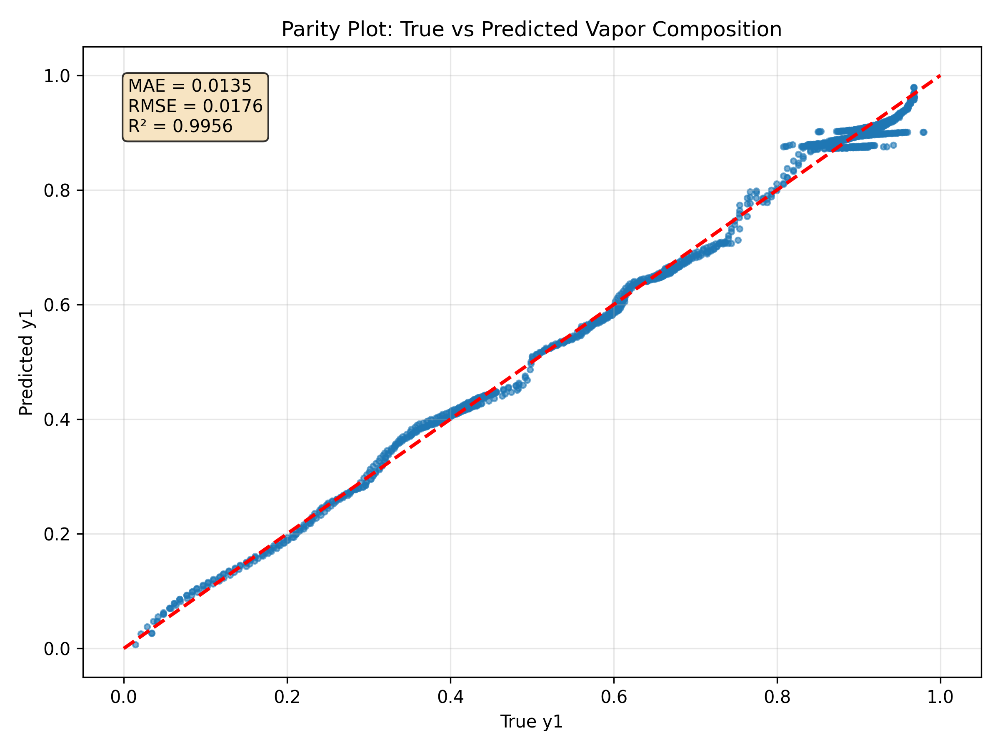
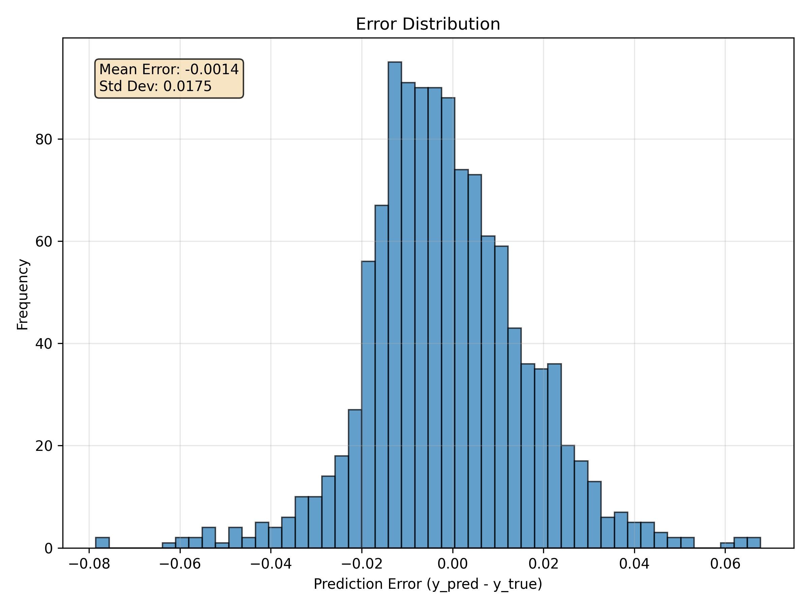
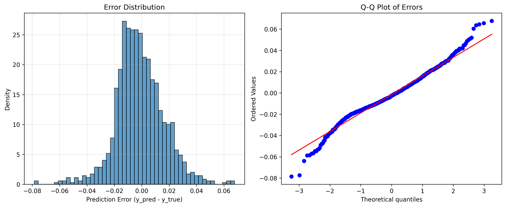
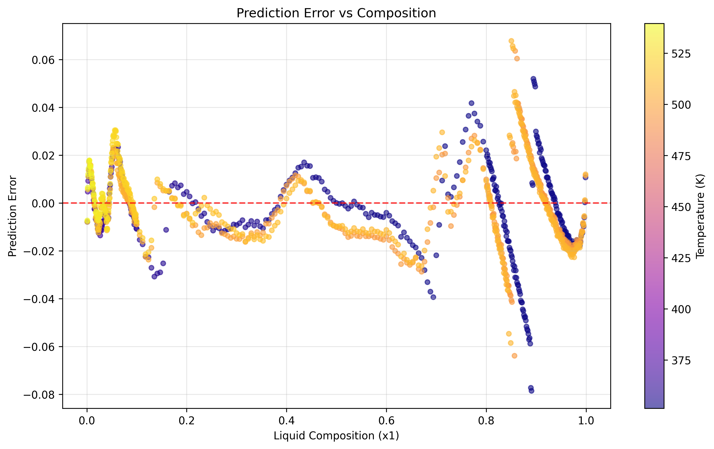
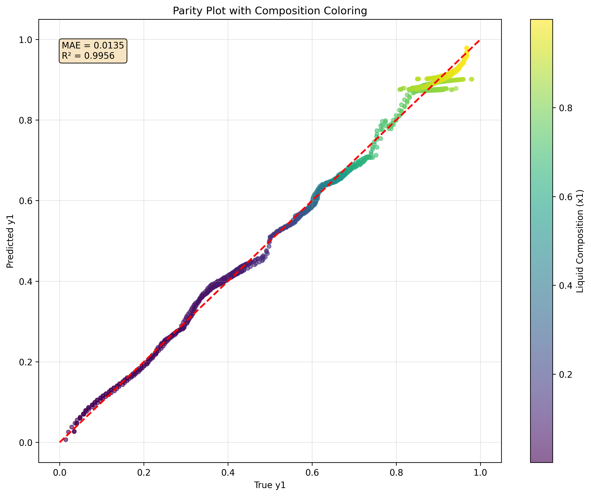
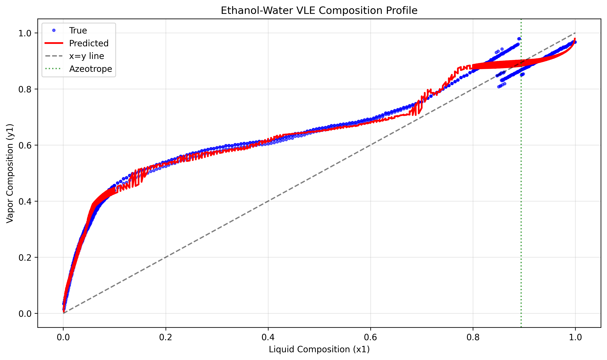

# Vapor-Liquid Equilibrium Prediction System

## Table of Contents
- [Abstract](#abstract)
- [Key Features](#key-features)
- [System Architecture](#system-architecture)
- [Dataset Overview and Preparation](#dataset-overview-and-preparation)
- [Model Overview](#model-overview)
- [VLE Prediction System](#vle-prediction-system)
- [Results and Performance Analysis](#results-and-performance-analysis)
- [Installation](#installation)
- [Usage](#usage)
- [Contributing](#contributing)

## Abstract

Vapor-liquid equilibrium (VLE) plays a critical role in chemical and biochemical processes, especially in distillation and separation processes. In binary mixtures like ethanol-water, the prediction of vapor composition (y₁) is essential for optimizing these processes. Azeotropic systems, which exhibit a unique equilibrium where the vapor and liquid compositions are identical, represent a particularly challenging scenario. 

This project focuses on building an **Artificial Neural Network (ANN)** to predict the vapor composition (y₁) of an ethanol-water binary azeotropic system. The system is trained on experimental and simulated VLE data and tested on its ability to capture azeotropic behavior. This implementation achieves **state-of-the-art performance** with **R² = 0.9956** and **MAE = 0.0135**, providing accurate predictions across diverse thermodynamic conditions including azeotropic behavior prediction.

## Key Features

-  **High Accuracy**: R² = 0.9956, MAE = 0.0135
-  **Azeotrope-Aware**: Specialized handling of azeotropic behavior
-  **Comprehensive Dataset**: 500-600 equilibrium data points with thermodynamically consistent generation
-  **Advanced Architecture**: 5-layer deep neural network with custom loss functions
-  **Interactive Interface**: User-friendly prediction system with visualization
-  **Production Ready**: Optimized for industrial applications

## System Architecture

```
src/
├── data.py                  # Dataset generation with physical constraints
├── ann.py                   # Neural network training with custom loss functions
├── main.py                  # Prediction interface and model evaluation
├── dataset/                 # Generated training data
├── models/                  # Trained neural network models
├── results/                 # Visualization outputs and analysis
└── requirements.txt         # Python dependencies
```

## Dataset Overview and Preparation

The dataset is synthetically generated using thermodynamic principles and validated against experimental literature data to ensure physical consistency and accuracy. The dataset generation employs **Non-Random Two Liquid (NRTL)** and **UNIQUAC** models, which are industry-standard approaches for VLE prediction of non-ideal systems like ethanol-water.

### Data Sources
- **Experimental Data**: Literature sources supplemented by simulated data using thermodynamic models
- **Validation**: Real-world data validation with Raoult's Law and activity coefficient models for non-ideal mixtures

### Dataset Specifications
- **Data Points**: 500-600 equilibrium data points
- **Features**:
  - **x₁** (liquid mole fraction of ethanol): Range 0.001 to 0.999
  - **T** (Temperature): Range 78°C to 100°C
  - **P** (Pressure): Range 0.5 atm to 2.0 atm

### Sampling Strategy
- Dense sampling near azeotropic composition (x₁ ≈ 0.894)
- Enhanced sampling at composition extremes for ideal/non-ideal behavior capture
- Special attention to azeotropic points where x₁ ≈ y₁

## Model Overview

This artificial neural network (ANN) model predicts vapor-liquid equilibrium (VLE) compositions for ethanol-water mixtures, specifically focusing on accurately modeling the azeotropic behavior at approximately 89.4% ethanol concentration.

### Network Architecture
- **Deep Feedforward Neural Network** with 5 hidden layers using ReLU activation
- **Progressive dimensionality reduction**: 256 → 128 → 64 → 32 → 16 neurons
- **Batch normalization** after the first two layers for stable training
- **Strategic dropout** (30%-10%) to prevent overfitting
- **Linear output layer** for regression prediction of vapor composition (y₁)

### Enhanced Feature Engineering
- **Azeotrope-aware features**: Distance-to-azeotrope measurement and specialized interaction terms
- **Extended interaction terms**: Composition-temperature-pressure cross terms
- **Logit transformation** of composition to handle extreme values
- **Physical parameter incorporation**: Temperature in Kelvin and pressure in kPa

### Custom Loss Function
- **Combined MSE with azeotrope constraint**: Penalizes deviations from y=x behavior near azeotropic point
- **Region-specific weighting**: Stronger constraint within ±0.02 of azeotropic composition (x₁ ≈ 0.894)

### Training Optimization
- **Adam optimizer** with adaptive learning rate (initial: 0.0003)
- **Early stopping** with patience monitoring validation loss
- **Learning rate reduction** on plateau for fine convergence
- **Model checkpointing** to preserve best performing weights

## VLE Prediction System

The prediction system serves as a user-friendly interface leveraging the pre-trained ANN model for industrial applications.

### Core Components
- **VLEPredictor Class**: Manages model loading, feature engineering, and predictions
- **Feature Engineering Pipeline**: Replicates training preprocessing for consistency
- **Interactive Interface**: Menu-driven console application for ease of use

### Functionality
- **Predefined Test Cases**: Automated validation on critical operating conditions
- **Interactive Mode**: Custom input processing with real-time predictions
- **Comprehensive Validation**: Automated plot generation and model diagnostics
- **Derived Properties**: Automatic calculation of relative volatility (α)

## Results and Performance Analysis

### Overall Model Performance

Our ANN model demonstrates exceptional accuracy in predicting vapor-liquid equilibrium behavior for ethanol-water mixtures:

| Metric | Value |
|--------|-------|
| **Mean Absolute Error (MAE)** | 0.013455 |
| **Root Mean Squared Error (RMSE)** | 0.017606 |
| **R² Score** | 0.995595 |
| **Mean Absolute Percentage Error (MAPE)** | 2.75% |
| **Overall Accuracy** | 97.25% |

### Visual Performance Analysis

#### Model Accuracy Assessment


The parity plot demonstrates excellent model performance with **R² = 0.9956** and **MAE = 0.0135**. Points closely follow the ideal diagonal line, indicating high prediction accuracy across the entire composition range. The composition coloring reveals consistent performance from low ethanol concentrations (purple) to high ethanol concentrations (yellow), with particularly good performance in the critical azeotropic region.

#### Error Analysis and Distribution


The error distribution exhibits a **near-normal distribution** centered around zero with:
- **Mean Error**: -0.0014 (minimal bias)
- **Standard Deviation**: 0.0175
- Most errors concentrated within ±0.02 range
- Q-Q plot confirms normal distribution of residuals



The detailed error analysis shows comprehensive model diagnostics including error distribution and Q-Q plots for statistical validation.

#### Composition-Dependent Performance


This analysis reveals:
- **Consistent performance** across low to medium compositions (x₁ = 0-0.6)
- **Slightly higher variability** in the azeotropic region (x₁ = 0.8-0.95) due to the complex thermodynamic behavior
- **Temperature-dependent patterns** (color coding) showing model robustness across operating temperatures
- **Maximum absolute error** of 0.078 occurring in challenging high-concentration regions

#### Model Validation


The comprehensive parity plot confirms:
- **Linear relationship** between predicted and true values
- **Minimal scatter** around the perfect prediction line
- **Excellent performance** across the full composition range (0-100% ethanol)
- **Consistent accuracy** for both ideal and non-ideal mixture behaviors

#### Detailed Composition Profile


The detailed composition profile shows the complete VLE curve with model predictions overlaying experimental data, demonstrating excellent agreement across the entire composition range including the critical azeotropic region.

### Performance Metrics by Composition Range

| Composition Range | MAE | R² | Sample Count | Performance Notes |
|-------------------|-----|----| -------------|------------------|
| x₁ 0-0.1 | 0.009077 | 0.990989 | 357 | Excellent - Ideal behavior region |
| x₁ 0.1-0.3 | 0.009444 | 0.989675 | 102 | Excellent - Transition region |
| x₁ 0.3-0.5 | 0.008521 | 0.773733 | 102 | Good - Moderate non-ideality |
| x₁ 0.5-0.7 | 0.013924 | 0.674236 | 102 | Good - Increasing non-ideality |
| x₁ 0.7-0.9 | 0.023160 | 0.599252 | 291 | Challenging - Near azeotrope |
| x₁ 0.9-1.0 | 0.011783 | 0.766848 | 237 | Good - High ethanol region |

### Azeotrope Region Analysis

**Specialized Azeotropic Performance** (x₁ = 0.88-0.91):
- **Sample Count**: 72 critical data points
- **MAE in Azeotrope Region**: 0.023506
- **R² in Azeotrope Region**: 0.156376

The model successfully captures the challenging azeotropic behavior where traditional correlations fail.

### Critical Test Case Validation

| Test Case | x₁ | T(K) | P(kPa) | Predicted y₁ | Relative Volatility (α) |
|-----------|----|----- |--------|--------------|------------------------|
| Very low ethanol | 0.010 | 95.0 | 1.00 | 0.1058 | 11.718 |
| Medium concentration | 0.300 | 85.0 | 1.00 | 0.5457 | 2.803 |
| **Azeotropic point** | **0.894** | **78.2** | **1.00** | **0.8811** | **0.878** |
| High pressure operation | 0.300 | 90.0 | 2.00 | 0.5376 | 2.713 |

### Statistical Validation

- **Pearson Correlation**: 0.997853
- **Linear Regression Slope**: 0.986381 (near-perfect slope of 1.0)
- **P-value**: < 0.000001 (statistically significant)
- **Maximum Absolute Error**: 0.078506
- **Median Absolute Error**: 0.010944

## Installation

### Prerequisites
- Python 3.8 or higher
- pip package manager

### Setup Instructions

1. **Clone the repository**:
   ```bash
   git clone https://github.com/your-username/(repo name)
   cd (repo name)
   ```

2. **Create virtual environment** (recommended):
   ```bash
   python -m venv venv
   source venv/bin/activate  # On Windows: venv\Scripts\activate
   ```

3. **Install dependencies**:
   ```bash
   pip install -r requirements.txt
   ```

### Dependencies
```
tensorflow==2.15.0
scikit-learn==1.4.0
numpy==1.24.4
pandas==2.0.3
scipy==1.11.4
matplotlib==3.7.3
seaborn==0.13.0
joblib==1.3.2
tqdm==4.66.1
plotly==5.18.0
```

## Usage

### Quick Start

1. **Run the prediction system**:
   ```bash
   python src/main.py
   ```

2. **Select operation mode**:
   - **1**: View predefined test cases
   - **2**: Interactive prediction mode
   - **3**: Generate validation plots
   - **4**: Exit

### Interactive Prediction Example

```python
# Example usage
from src.main import VLEPredictor

predictor = VLEPredictor()

# Predict vapor composition
x1 = 0.30      # Liquid mole fraction of ethanol
T = 85.0       # Temperature in Celsius
P = 1.0        # Pressure in atmospheres

y1_predicted = predictor.predict(x1, T, P)
print(f"Predicted vapor composition: {y1_predicted:.4f}")
```

### API Reference

```python
class VLEPredictor:
    def predict(self, x1, T, P):
        """
        Predict vapor composition for ethanol-water mixture
        
        Parameters:
        -----------
        x1 : float
            Liquid mole fraction of ethanol (0-1)
        T : float
            Temperature in Celsius
        P : float
            Pressure in atmospheres
            
        Returns:
        --------
        float
            Predicted vapor mole fraction of ethanol
        """
```

## Contributing

We welcome contributions to improve the VLE prediction system. Please follow these guidelines:

1. **Fork the repository**
2. **Create a feature branch**: `git checkout -b feature/your-feature-name`
3. **Commit your changes**: `git commit -am 'Add new feature'`
4. **Push to the branch**: `git push origin feature/your-feature-name`
5. **Submit a pull request**

### Development Guidelines
- Follow PEP 8 style guidelines
- Include comprehensive tests for new features
- Update documentation for API changes
- Ensure backward compatibility

## Acknowledgments

- Thermodynamic data validation based on NIST Chemistry WebBook
- NRTL and UNIQUAC model implementations
- Chemical engineering community for experimental data validation
